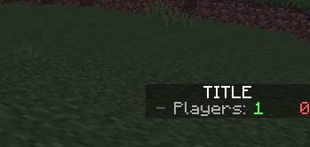

# ScoreboardAPI

Create easy scoreboards



**How to create a scoreboard: ([Example](https://github.com/r3pt1s/ScoreboardAPI/blob/main/example/src/example/ScoreboardExample.php))**
 ```php
$scoreboard = new Scoreboard("TITLE", "exampleScore", [$player]);
$scoreboard->removeScoreboard();
$scoreboard->createScoreboard();
$scoreboard->addEntry("§8- §7Players: §a" . count($this->getServer()->getOnlinePlayers()));


